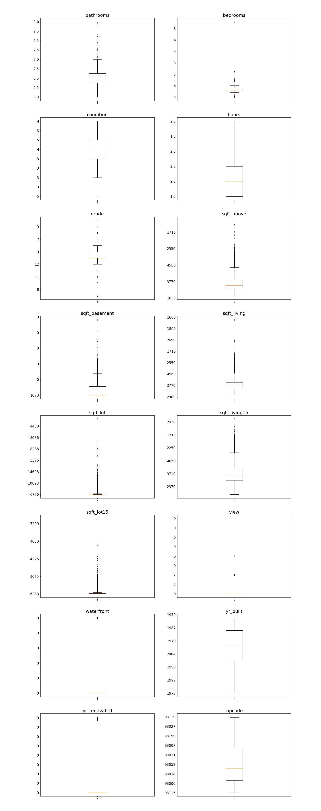

# King's County Housing Prices

# Project Overview

The following information was given in order to create the best model for predicting housing prices in King's County, Washington. 
* **id** - unique ID for a house
* **date** - Date day house was sold
* **price** - Price is prediction target
* **bedrooms** - Number of bedrooms
* **bathrooms** - Number of bathrooms
* **sqft_living** - square footage of the home
* **sqft_lot** - square footage of the lot
* **floors** - Total floors (levels) in house
* **waterfront** - Whether house has a view to a waterfront
* **view** - Number of times house has been viewed
* **condition** - How good the condition is (overall)
* **grade** - overall grade given to the housing unit, based on King County grading system
* **sqft_above** - square footage of house (apart from basement)
* **sqft_basement** - square footage of the basement
* **yr_built** - Year when house was built
* **yr_renovated** - Year when house was renovated
* **zipcode** - zip code in which house is located
* **lat** - Latitude coordinate
* **long** - Longitude coordinate
* **sqft_living15** - The square footage of interior housing living space for the nearest 15 neighbors
* **sqft_lot15** - The square footage of the land lots of the nearest 15 neighbors

# Data
The boxplots were used to reference outliers visually.

The scatter plots were used to determine if there are correlations between the columns listed above and the price. Some scatter plots display categorical data which were broken down into box plots during the modeling process. 

The next image is an example of a categorical boxplot created for bathrooms.

Here are boxplots representing the price and outliers for houses with different numbers of bathrooms. Housing prices increases as number of bathrooms increases. My assumption is the large amount of outliers would be because nice apartments in cities might have less space for bathrooms and overall be costly.

This bar graph symbolizes the median housing price per zipcode.  

# Model

This is an example of an ols model. 

My best model Root Mean Squared Error from the data in the training set was $145,618.88 and the RMSE from the test set $155,035.15. SelectKBest was used to eliminate ploynomial features which didn't aid the models ability to predict housing prices, shown by a lower RMSE value.  

# Summary

My model with zipcodes did the best. My interpretation is that zipcodes had a large influence on housing prices. I expected conditions and views to have more weight than they actually seemed to carry. My recommendation for real estate agents is to pay attention to the location of the house.